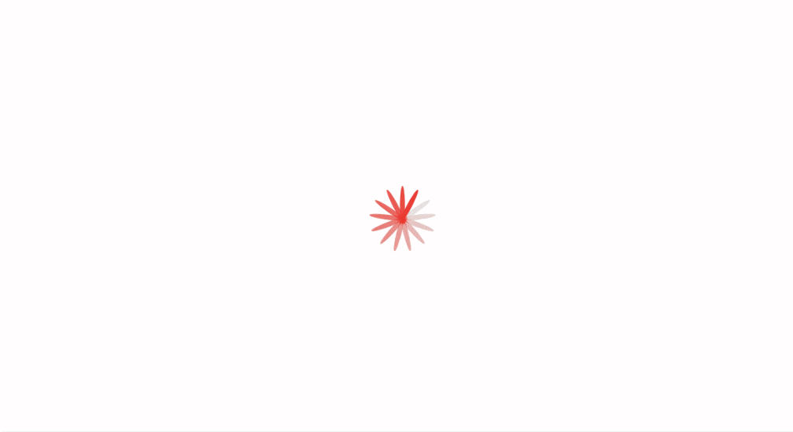

# 
BuzzQuizz

### 
Inspiração do site BuzzFeed 

   
   
    
   

### :clipboard: Descrição

Este projeto é uma aplicação web inspirada nas funcionalidades do Buzzfeed. Ele permite aos usuários visualizar e criar quizzes divertidos e interativos. Com uma interface fácil de usar, os usuários podem navegar pelos quizzes disponíveis, criar seus próprios. Além disso, os usuários podem editar e deletar os quizzes que criaram. Dê uma olhada e divirta-se!

#### 🖱️ [Acesse aqui](https://gabrielatiago.github.io/BuzzQuizz/)

---

### 🚨 Validações

Para que você consiga criar um quiz, atente-se aos seguintes critérios:

- Informações básicas do quiz:
  - Título do quizz: deve ter no mínimo 20 e no máximo 65 caracteres
  - URL da Imagem: deve ter formato de URL (PNG, JPG, etc)
  - Quantidade de perguntas: no mínimo 3 perguntas
  - Quantidade de níveis: no mínimo 2 níveis
- Perguntas do quiz:
  - Texto da pergunta: no mínimo 20 caracteres
  - Cor de fundo: deve ser uma cor em hexadecimal (começar em "#", seguida de 6 caracteres hexadecimais, ou seja, números ou letras de A a F)
  - Textos das respostas: não pode estar vazio
  - URL da Imagem: deve ter formato de URL (PNG, JPG, etc)
- Níveis do quiz:
  - Título do nível: mínimo de 10 caracteres
  - Porcentagem de acerto mínima: um número entre 0 e 100
  - URL da Imagem: deve ter formato de URL (PNG, JPG, etc)
  - Descrição do nível: mínimo de 30 caracteres
  - É obrigatório existir pelo menos 1 nível cuja % de acerto mínima seja 0%

---

### :computer: Telas

    <h5>Desktop:</h5>
    
    <h5>Tablet:</h5>
    
    <h5>Mobile:</h5>
    

$~$

---

### 🎮 Usando

    <h5>Jogando o quiz:</h5>
    <h5>Criando um novo quiz:</h5>
    <h5>Editando, validações e deleção de um quiz:</h5>

$~$

---

### :books: Lições Aprendidas

- Utilização de múltiplos arquivos JS e CSS em um único projeto
- Consumo de uma API
- Uso dos métodos DELETE e PUT
- Uso de headers em requisições
- Utilização do Local Storage
- Validações de formulários
- Separação de responsabilidades
- Código limpo

---

### :bulb: Reconhecimentos

- [Badges para Github](https://github.com/alexandresanlim/Badges4-README.md-Profile#-database-)
- [README Inspiração de README](https://gist.github.com/luanalessa/7f98467a5ed62d00dcbde67d4556a1e4#file-readme-md)
- [Driven Education](https://www.driven.com.br)

---

### 👩‍🦱 Autora

- Gabriela Tiago é uma aluna de desenvolvimento web de Fullstack na Driven Education. Percorrendo o caminho do conhecimento, buscando aprimorar suas habilidades técnicas e de softskills, para que ela possa melhorar o trabalho que desenvolve.

 [🔝 De volta ao topo](#buzzquizz) 
